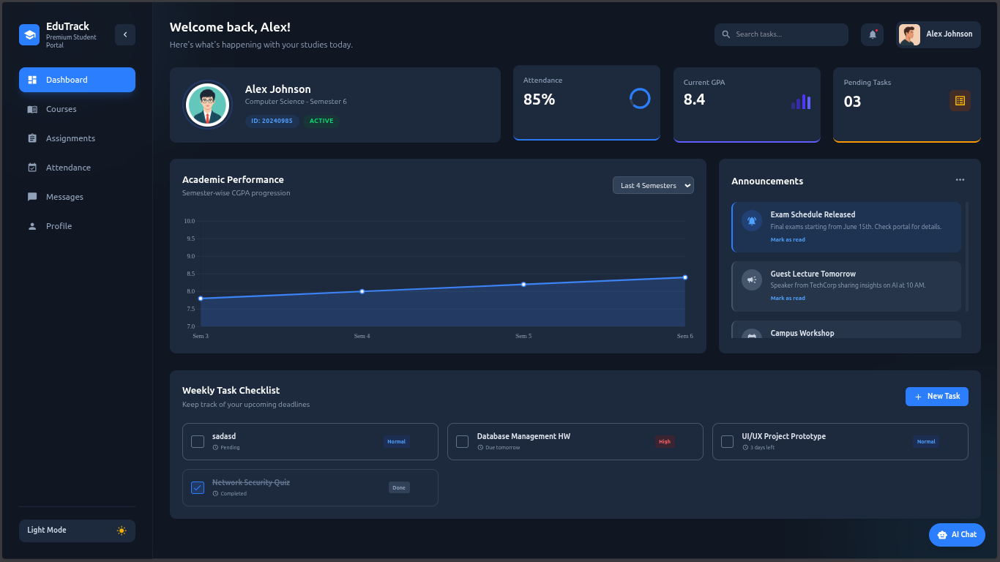

# EduTrack – Student Dashboard Portal

EduTrack is a modern student dashboard built with React + Vite + Tailwind CSS. It includes authentication, dashboard analytics, task and message management, editable profile settings, dark mode, and an in-app AI assistant.

## Preview



## Features

- Login flow with session persistence (stays logged in on refresh during the same browser session)
- Animated dashboard entry after login
- Dark/Light theme toggle
- Sidebar navigation with modules:
  - Dashboard
  - Courses
  - Assignments
  - Attendance
  - Messages
  - Profile
- Dashboard widgets:
  - Profile card + stats
  - Semester-wise CGPA trend chart
  - Searchable announcements panel with read/clear actions
  - Task checklist with add/complete/delete + persistence
- Messages module with send/delete + persistence
- Editable profile page (name, email, phone, semester, department, about) + persistence
- In-app AI chatbot that understands app features and current app state
- Global button hover fill effect and animated app background

## Tech Stack

- React 19
- Vite 7
- Tailwind CSS 4
- Chart.js + react-chartjs-2
- React Icons

## Getting Started

### 1) Clone and install

```bash
git clone <your-repo-url>
cd frontend-frenzy
npm install
```

### 2) Start development server

```bash
npm run dev
```

### 3) Build for production

```bash
npm run build
```

### 4) Preview production build

```bash
npm run preview
```

## Demo Login Credentials

- Email: alex@edutrack.com
- Password: 123456

## Project Scripts

- `npm run dev` → start Vite dev server
- `npm run build` → production build
- `npm run preview` → preview production build
- `npm run lint` → run ESLint

## Project Structure

```text
src/
	components/
		AiChatbot.jsx
		BottomRow.jsx
		Header.jsx
		LoginPage.jsx
		MiddleRow.jsx
		ProfilePage.jsx
		Sidebar.jsx
		TopRow.jsx
	App.jsx
	index.css
	main.jsx
```

## Data Persistence

- `sessionStorage`
  - `authUser` (current login session)
  - chatbot history
- `localStorage`
  - theme preference
  - tasks
  - messages
  - profile details

## Notes

- This is a frontend demo project with local, mock authentication.
- No backend or real AI API is connected.
- App data is persisted in browser storage only.
